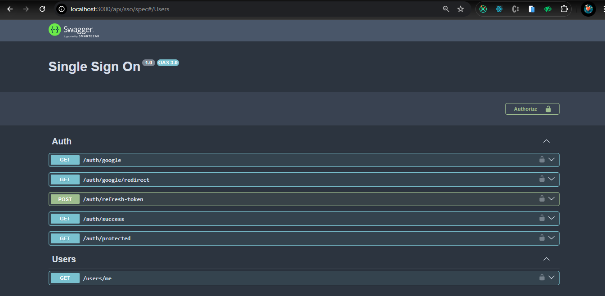
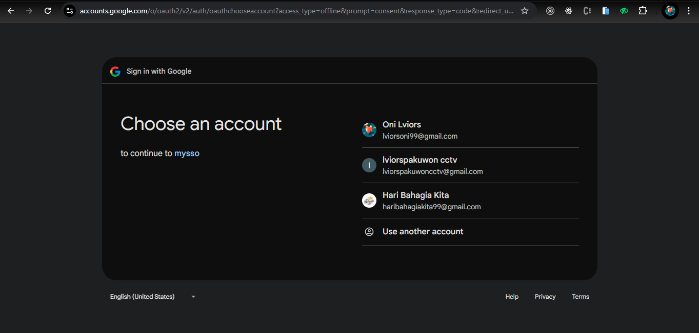
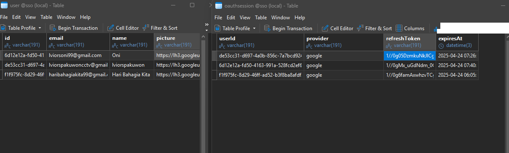

# Single Sign-On (SSO) with NestJS
### 📌 Overview
This project implements Single Sign-On (SSO) authentication using NestJS as the backend. It supports authentication via Google OAuth and session management using HTTP-only cookies.
### 🛠️ Technologies Used
- NestJS - Framework for building scalable backend applications
- Passport.js - Authentication middleware
- OAuth2 Strategy - Google OAuth implementation
- Prisma - ORM for database management
- JWT - JSON Web Token for authentication
### 🚀 Installation & Setup
#### Backend (NestJS)
```bash
$ git clone https://github.com/oniauliya99/nest-google-sso.git
$ cd nest-google-sso

# Install dependencies
pnpm install

# Set up environment variables (.env)
GOOGLE_CLIENT_ID=your_google_client_id
GOOGLE_CLIENT_SECRET=your_google_client_secret
JWT_SECRET=your_jwt_secret
DATABASE_URL=your_database_url

# Start the server
pnpm dev
```
### 🔐 Authentication Flow
1. The user clicks the Sign in with Google button.
2. The frontend redirects the user to /auth/google.
3. Google handles authentication and redirects back to /auth/google/redirect.
4. The backend issues an access token and stores a refresh token in an HTTP-only cookie.
5. The frontend receives the token and stores it in localStorage.
6. The user can access protected routes using the token.

### 📜 API Endpoints
| Method | Endpoint                  | Description                |
|--------|---------------------------|----------------------------|
| **GET** | `/auth/google`            | Redirect to Google OAuth   |
| **GET** | `/auth/google/redirect`   | Google OAuth callback      |
| **POST** | `/auth/refresh-token`     | Refresh expired access token |
| **POST** | `/auth/logout`            | Log out and clear cookies  |
| **GET** | `/auth/protected`   | Checks if the request contains a valid authentication token      |
| **GET** | `/users/me`            | Get the logged-in user details   |

### 🖼️ Screenshots
- Swagger
 
- Redirect Login
  
- Database 
  

### 📌 Notes
- Make sure to replace your_google_client_id and your_google_client_secret in .env.
